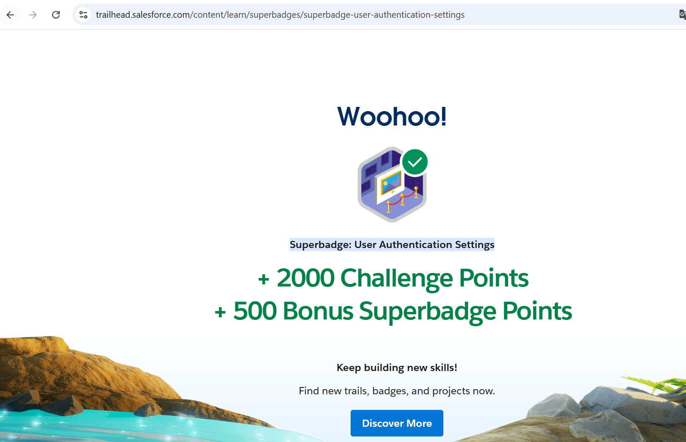

# Superbadge: User Authentication Settings

<p align="center">
  
</p>

Projeto de apoio e registro do superbadge **User Authentication Settings**, do Salesforce Trailhead.

O desafio valida configuracoes essenciais de autenticacao e seguranca de acesso em uma Developer Edition org preparada especialmente para o superbadge.

<p align="center">
  
</p>

## Objetivo

Elevar as configuracoes de autenticacao de usuarios da org aos padroes exigidos pelo cenario do superbadge, cobrindo politicas de senha, limites de login, acesso por aplicativo conectado e redes confiaveis.

## O que e indispensavel no desafio

### 1. Politicas de senha da org

- Senhas com no minimo 12 caracteres.
- Exigencia de letras, numeros e caracteres especiais.
- Bloqueio apos 3 tentativas de login sem sucesso.
- Duracao do bloqueio: 30 minutos.
- Limitar redefinicao de senha a 1 vez em 24 horas.
- Ocultar a resposta da pergunta de seguranca durante o processo de redefinicao.

### 2. Politicas de senha para administradores

Para usuarios com perfil **System Administrator**:

- Senha com no minimo 15 caracteres.
- Exigencia de numeros, letras maiusculas, letras minusculas e caracteres especiais.

### 3. Restricoes de login por perfil

Perfis customizados envolvidos:

- **Inside Sales Representatives**
- **Call Center Agents**

Regras principais:

- Inside Sales pode acessar pelo escritorio corporativo ou pela VPN.
- Inside Sales nao possui restricao de horario.
- Call Center pode acessar apenas pelo escritorio corporativo.
- Call Center pode acessar somente de segunda a sexta, das 8h as 17h.

IPs usados no desafio:

| Local | IP ou faixa |
| --- | --- |
| Corporate Office | `13.108.0.0` |
| VPN | `22.0.0.1 - 22.0.255.0` |

### 4. Controle de acesso a apps conectados

- Restringir o acesso de API a apps conectados permitidos.
- Impedir autoautorizacao de usuarios para apps conectados.
- Exigir aprovacao do administrador para acesso aos apps.
- Manter o **Trailhead Connected App** sem alteracoes.
- Permitir acesso mobile somente para usuarios de Inside Sales.
- Para Inside Sales, permitir apenas o app **Salesforce for iOS**.

### 5. Rede confiavel

- Configurar o IP `13.108.0.0` como rede confiavel.
- Permitir que usuarios no escritorio corporativo ignorem o desafio de verificacao de identidade/dispositivo.

## Estrutura do repositorio

```text
.
|-- README.md
|-- LICENSE
|-- sfdx-project.json
|-- .gitignore
|-- manifest/
|   `-- package.xml
|-- force-app/
|   `-- main/default/
|       |-- profilePasswordPolicies/
|       |-- profiles/
|       `-- settings/
`-- doc/
    |-- metadata.md
    `-- imagens/
        |-- badge.png
        |-- congratulations.png
        |-- logo.png
        `-- mascote.png
```

## Metadados recuperados

Os metadados essenciais foram recuperados da org autenticada como `user-auth-settings` e estao em formato SFDX em `force-app/main/default`.

Resumo tecnico: [doc/metadata.md](doc/metadata.md)

## Evidencia de conclusao

<p align="center">
  
</p>

<p align="center">
  
</p>

## Referencia oficial

- [Superbadge: User Authentication Settings - Salesforce Trailhead](https://trailhead.salesforce.com/pt-BR/content/learn/superbadges/superbadge-user-authentication-settings)

## Autor

Leandro da Silva Stampini
